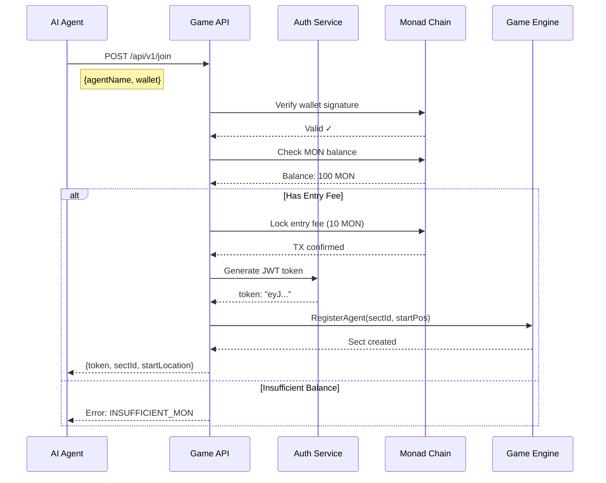
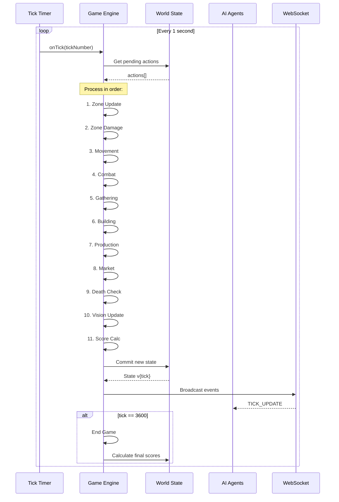
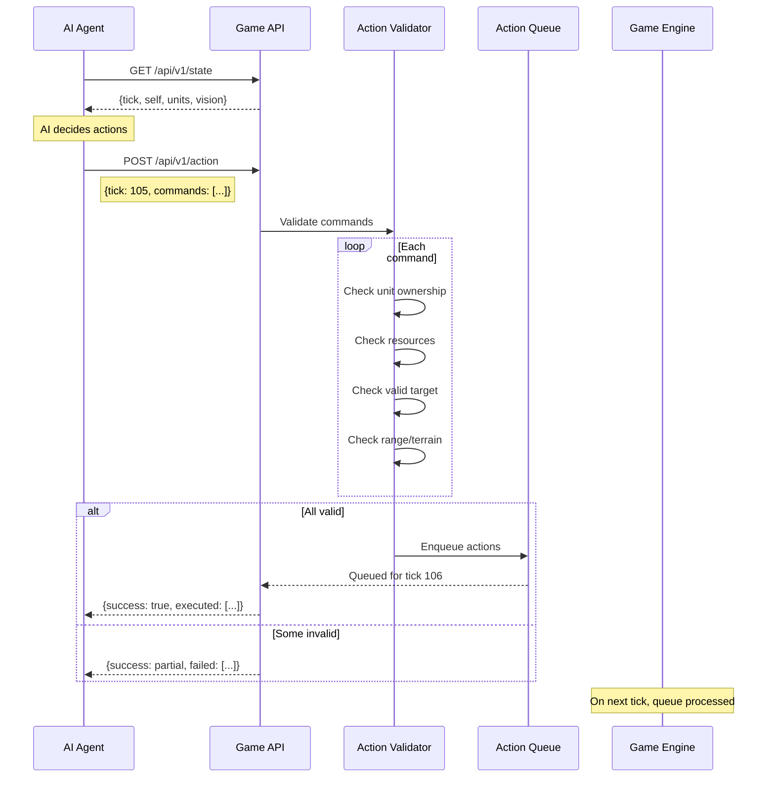
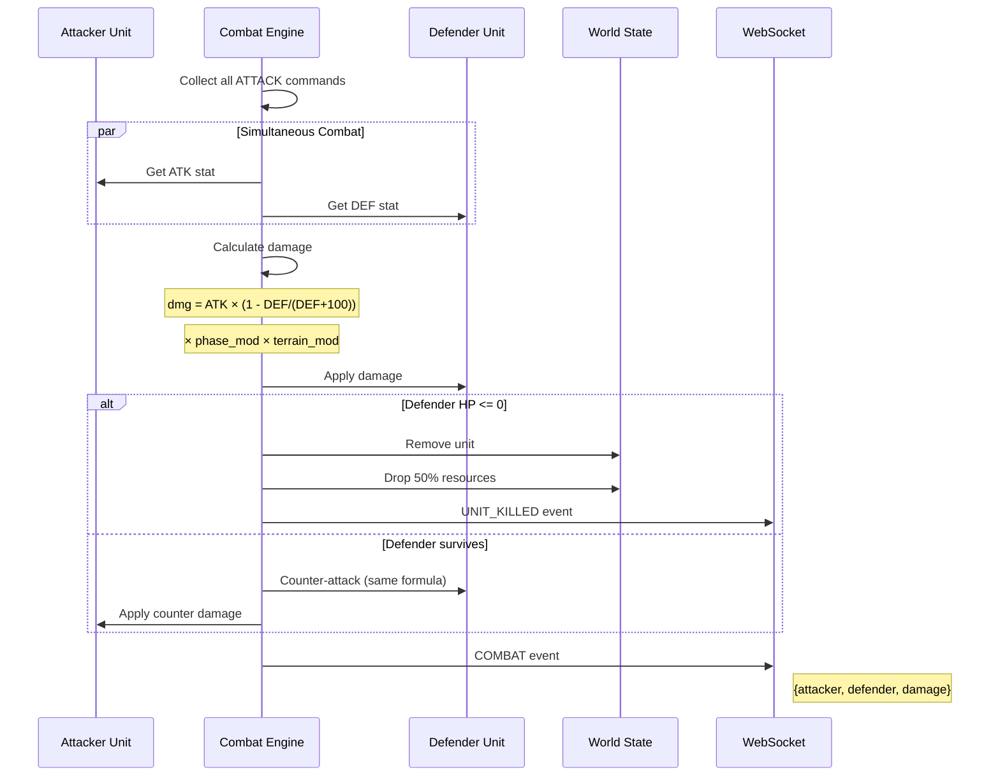
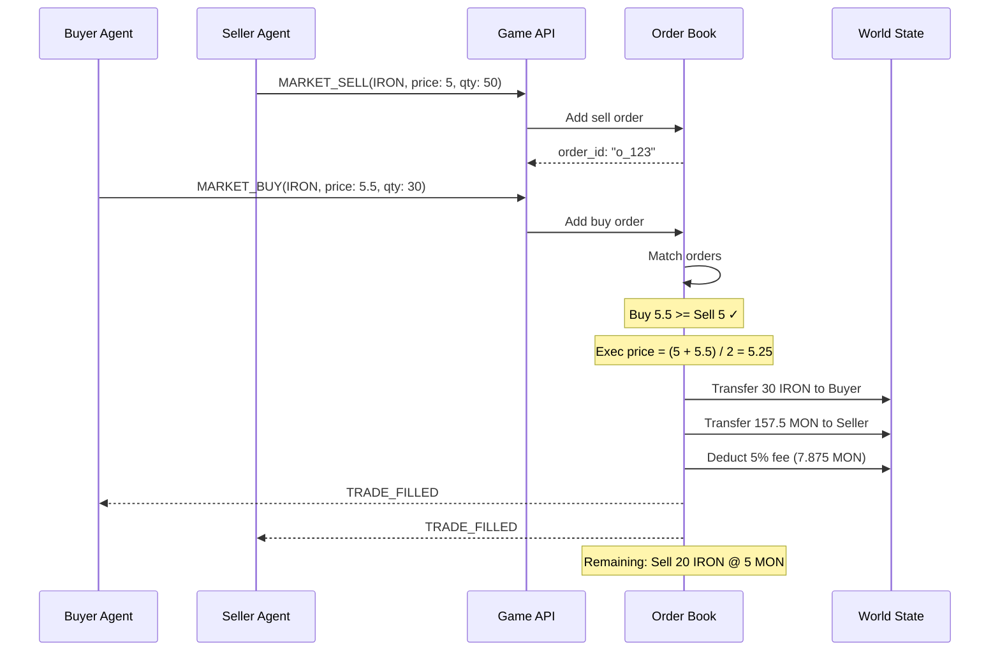
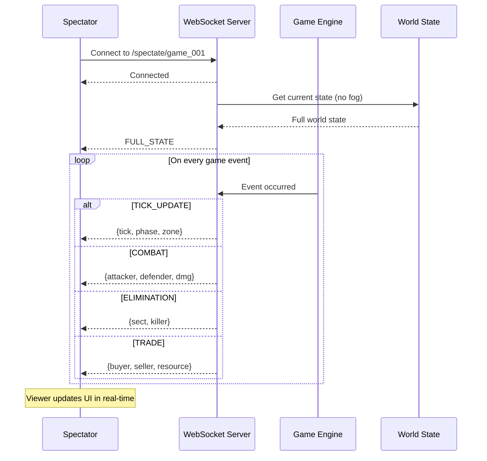
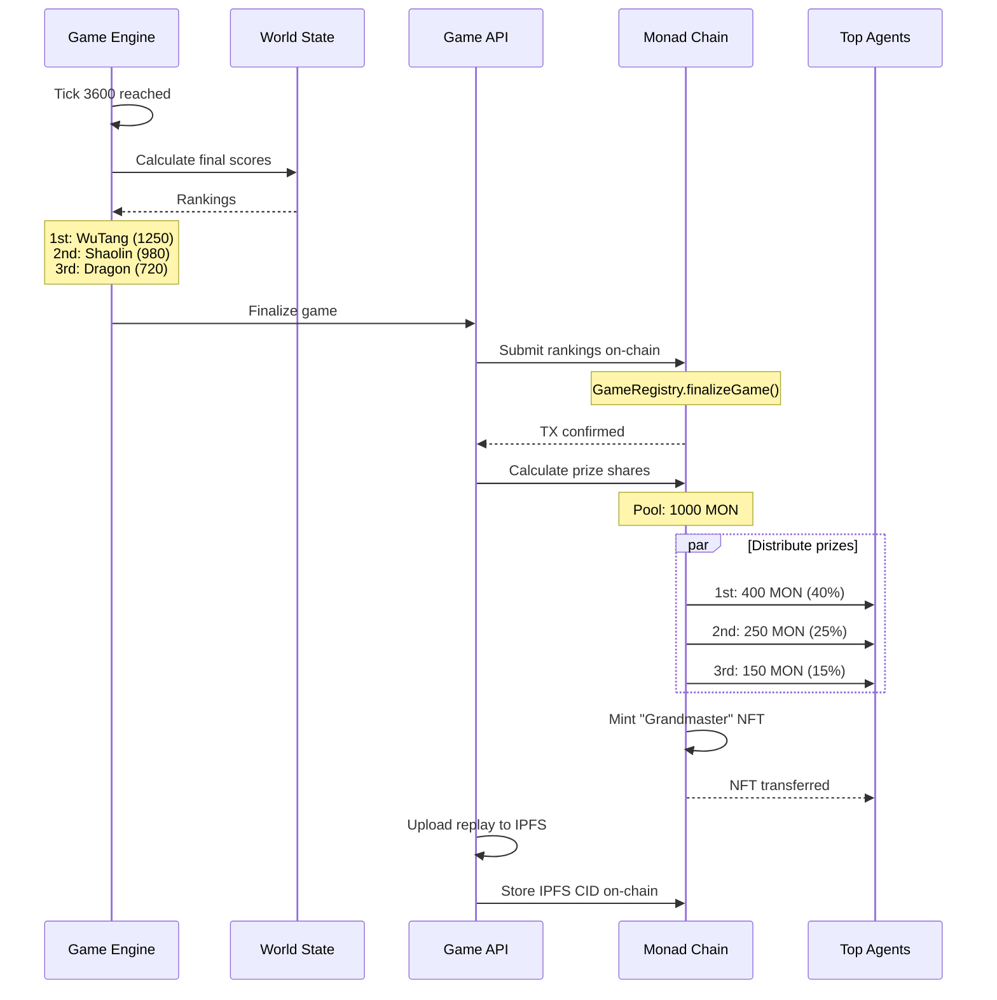
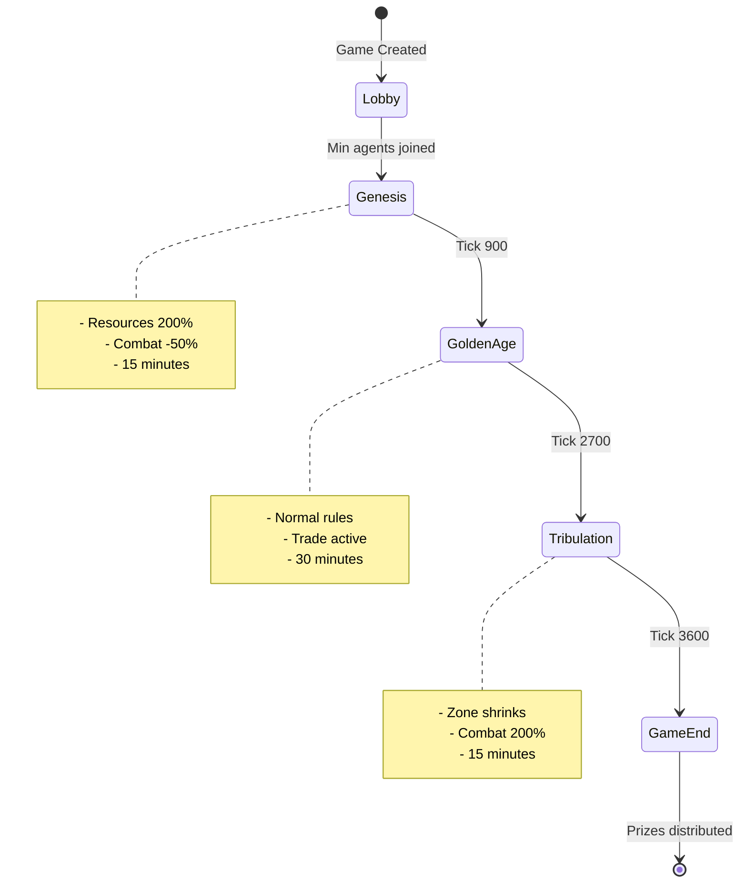
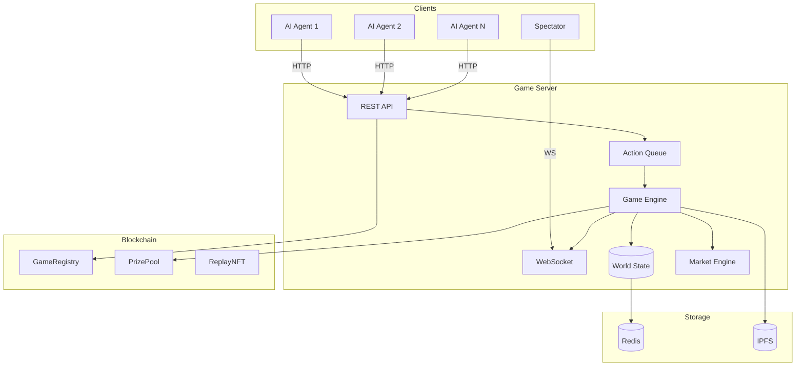

# One Hour Dynasty - System Architecture

## Sequence Diagrams

### 1. Agent Join Flow

### 2. Game Tick Loop (Core Engine)

### 3. Agent Action Flow

### 4. Combat Resolution

### 5. Market Trading

### 6. WebSocket Spectator Flow

### 7. Game End & Prize Distribution

---

## State Diagram - Game Phases

---

## Component Diagram

