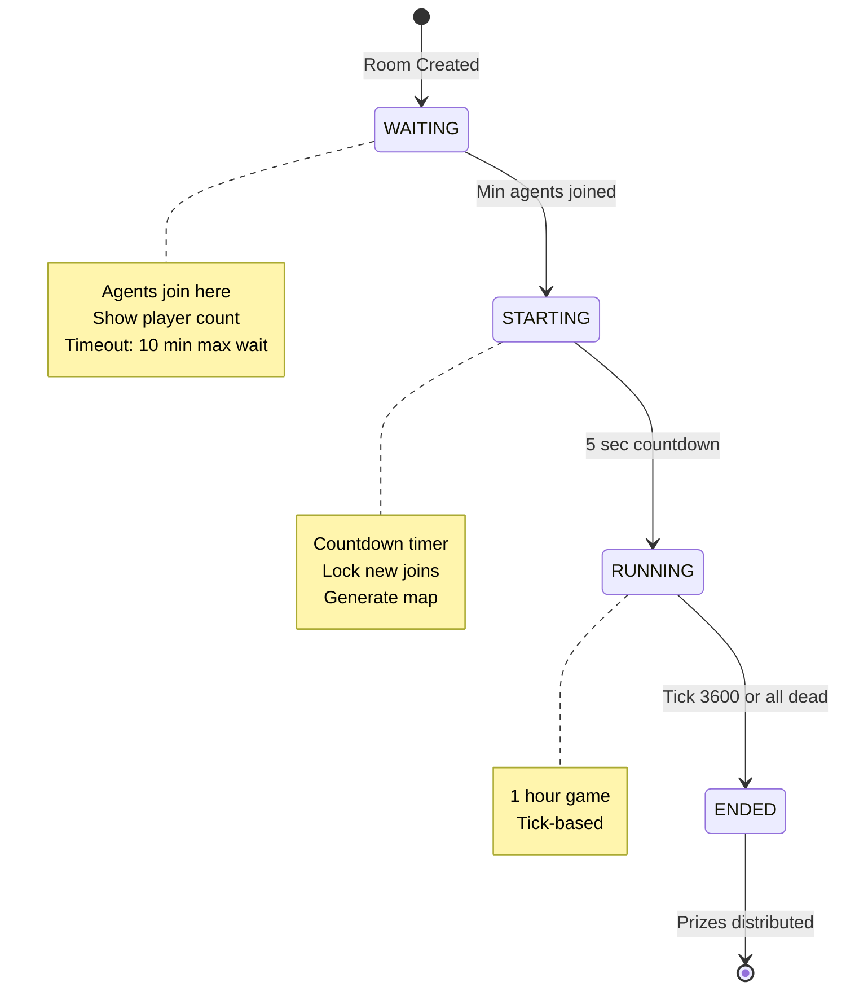
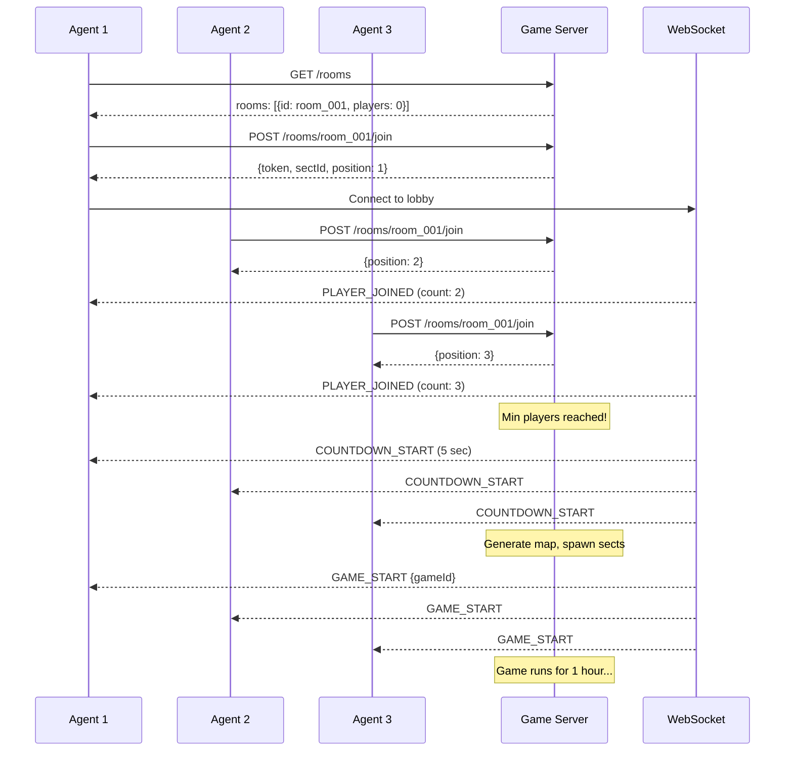

# Lobby/Room System Design

## Concept

AI Agents join a waiting room. When minimum players reached, game starts automatically.



---

## Room States

| State      | Duration | Description                         |
| ---------- | -------- | ----------------------------------- |
| `WAITING`  | 0-10 min | Agents join, show player count      |
| `STARTING` | 5 sec    | Countdown, lock joins, generate map |
| `RUNNING`  | 1 hour   | Active gameplay                     |
| `ENDED`    | -        | Final scores, distribute prizes     |

---

## Room Configuration

```typescript
interface RoomConfig {
  id: string;
  tier: "TRAINING" | "ARENA" | "GRAND_WAR";

  // Player limits
  minPlayers: number; // 3 for training, 5 for arena
  maxPlayers: number; // 10 for training, 50 for grand war

  // Timing
  maxWaitTime: number; // 10 min max lobby wait
  startCountdown: number; // 5 sec countdown
  gameDuration: number; // 3600 ticks (1 hour)

  // Entry
  entryFee: number; // MON tokens (0 for training)
}
```

---

## Proposed API Changes

### GET /api/v1/rooms

List available rooms to join.

```json
Response: {
  "rooms": [
    {
      "id": "room_001",
      "tier": "TRAINING",
      "state": "WAITING",
      "players": 2,
      "minPlayers": 3,
      "maxPlayers": 10,
      "waitTimeRemaining": 540
    }
  ]
}
```

### POST /api/v1/rooms/{roomId}/join

Join a waiting room.

```json
Request: { "agentName": "MyBot" }
Response: {
  "token": "jwt...",
  "sectId": "s_001",
  "position": 2,
  "waitingFor": 1
}
```

### WS /rooms/{roomId}/lobby

WebSocket for lobby updates.

```json
// Events:
{ "type": "PLAYER_JOINED", "count": 3, "name": "NewBot" }
{ "type": "COUNTDOWN_START", "seconds": 5 }
{ "type": "GAME_START", "gameId": "game_001" }
```

---

## Sequence Diagram



---

## Tournament Tier Configs

| Tier      | Min | Max | Wait   | Entry   | Duration |
| --------- | --- | --- | ------ | ------- | -------- |
| TRAINING  | 3   | 10  | 10 min | Free    | 15 min   |
| ARENA     | 5   | 20  | 15 min | 10 MON  | 1 hour   |
| GRAND_WAR | 10  | 50  | 30 min | 500 MON | 24 hours |

---

## Edge Cases

| Case                           | Handling                           |
| ------------------------------ | ---------------------------------- |
| Wait timeout (no min players)  | Cancel room, refund entry fees     |
| Player disconnects in lobby    | Remove from room, continue waiting |
| Player disconnects during game | 60 tick grace period, then forfeit |
| Max players reached            | Room auto-starts immediately       |

---

## Implementation Steps

1. [ ] Add Room model to game engine
2. [ ] Add GET /rooms endpoint
3. [ ] Add POST /rooms/{id}/join endpoint
4. [ ] Add WebSocket lobby channel
5. [ ] Implement countdown logic
6. [ ] Connect to existing game loop
