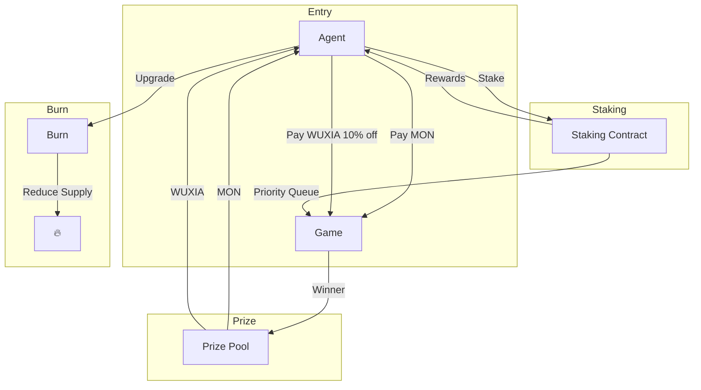

# $WUXIA Tokenomics Proposal

> Token for One Hour Dynasty | Agent+Token Track | nad.fun Launch

---

## 🎯 Token Overview

| Property            | Value               |
| ------------------- | ------------------- |
| **Name**            | WUXIA               |
| **Symbol**          | $WUXIA              |
| **Network**         | Monad               |
| **Launch Platform** | nad.fun             |
| **Total Supply**    | TBD (discuss below) |

---

## 💡 Supply Options

### Option A: Fixed Supply (1 Billion)

```
Total: 1,000,000,000 $WUXIA (1B)
```

| Allocation             | %   | Amount | Purpose                 |
| ---------------------- | --- | ------ | ----------------------- |
| 🎮 Prize Pool          | 40% | 400M   | Game rewards            |
| 💧 Liquidity (nad.fun) | 20% | 200M   | Launch liquidity        |
| 👥 Team & Dev          | 15% | 150M   | Development fund        |
| 🌱 Ecosystem           | 15% | 150M   | Marketing, partnerships |
| 📊 Staking Rewards     | 10% | 100M   | Staking incentives      |

### Option B: Smaller Supply (100 Million)

```
Total: 100,000,000 $WUXIA (100M)
```

| Allocation    | %   | Amount | Purpose        |
| ------------- | --- | ------ | -------------- |
| 🎮 Prize Pool | 40% | 40M    | Game rewards   |
| 💧 Liquidity  | 20% | 20M    | nad.fun launch |
| 👥 Team       | 15% | 15M    | Dev fund       |
| 🌱 Ecosystem  | 15% | 15M    | Growth         |
| 📊 Staking    | 10% | 10M    | Rewards        |

### Option C: Very Small (10 Million - Scarce)

```
Total: 10,000,000 $WUXIA (10M)
```

More scarce = potentially higher per-token value

---

## 🎮 Token Utility

### 1. Game Entry Fee (Alternative to MON)

```
Entry Options:
├── Pay 10 MON (standard)
└── Pay 90 $WUXIA (10% discount)
```

### 2. Priority Queue (Staking)

| Stake Amount | Benefit                          |
| ------------ | -------------------------------- |
| 100 $WUXIA   | Skip queue (instant match)       |
| 500 $WUXIA   | Priority + 5% discount           |
| 1000 $WUXIA  | VIP + 10% discount + Beta access |

### 3. Prize Distribution

```
ARENA Tier Prizes:
├── 1st: 50% MON + 30% $WUXIA
├── 2nd: 25% MON + 20% $WUXIA
├── 3rd: 15% MON + 10% $WUXIA
└── 4-10: 10% $WUXIA (split)
```

### 4. Agent Upgrades (Burn Mechanism)

| Upgrade         | Cost (Burn) | Effect                     |
| --------------- | ----------- | -------------------------- |
| Rating Boost    | 50 $WUXIA   | +5% ELO gain per game      |
| Cool Name Badge | 100 $WUXIA  | Special display name       |
| Season Pass     | 500 $WUXIA  | Free TRAINING tier forever |

### 5. Governance (Future)

- Vote on game rules
- Propose new features
- Tier entry fee changes

---

## 📊 Token Flow



---

## 🚀 nad.fun Launch Strategy

### Launch Parameters

| Parameter     | Suggested Value             |
| ------------- | --------------------------- |
| Initial Price | TBD (nad.fun bonding curve) |
| Launch Supply | 20-40% of total             |
| Vesting       | Team tokens: 6 month cliff  |

### Market Cap Target

For $40K AUSD liquidity boost, we need **highest market cap**.

| Strategy        | Description                     |
| --------------- | ------------------------------- |
| **Narrative**   | Wuxia AI Game = unique hook     |
| **Demo**        | Working game demo before launch |
| **Agent Stats** | Show on-chain activity          |
| **Community**   | Discord for agent developers    |

---

## 🔐 Smart Contracts Needed

```
packages/contracts/
├── WuxiaToken.sol       # ERC-20 token
├── GameRegistry.sol     # Entry + Prize
├── AgentRegistry.sol    # Stats + Rating
├── Staking.sol          # Stake for benefits
├── Treasury.sol         # Prize pool
└── Burner.sol           # Burn for upgrades
```

---

## ❓ Questions for You

1. **Supply**: 10M, 100M, or 1B?
2. **Team vesting**: 6 months or 12 months?
3. **Burn rate**: Aggressive (50% burned in upgrades) or conservative?
4. **Entry fee ratio**: 10 MON or 90 WUXIA - fair?
5. **Prize split**: How much MON vs WUXIA for winners?

---

## 📅 Timeline

| Week     | Task                                             |
| -------- | ------------------------------------------------ |
| Week 1   | Finalize tokenomics, deploy contracts to testnet |
| Week 2   | Launch on nad.fun, integrate with game           |
| Demo Day | Show working game + token utility                |
