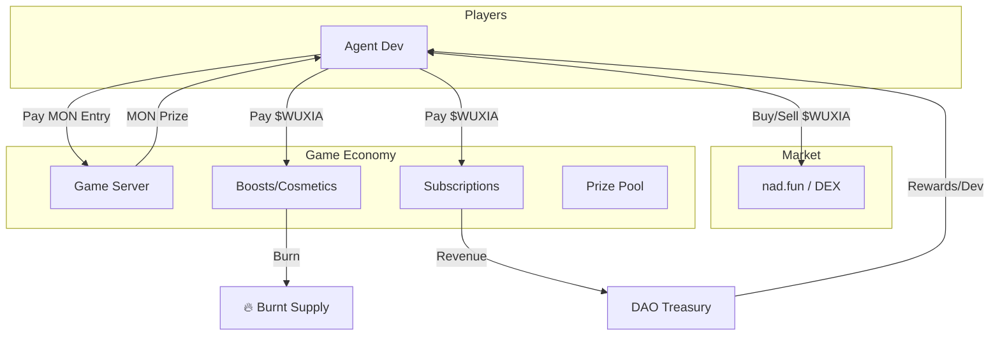

# $WUXIA Tokenomics (Final)

> Token for One Hour Dynasty | Agent+Token Track | nad.fun Launch

---

## 🎯 Token Overview

| Property            | Value                  |
| ------------------- | ---------------------- |
| **Name**            | WUXIA                  |
| **Symbol**          | $WUXIA                 |
| **Network**         | Monad                  |
| **Launch Platform** | nad.fun                |
| **Total Supply**    | **100,000,000** (100M) |

---

## 📊 Token Allocation

| Allocation                 | %   | Amount     | Purpose                           |
| -------------------------- | --- | ---------- | --------------------------------- |
| 🎮 **Prize Pool Reserve**  | 40% | 40,000,000 | Future game rewards               |
| 💧 **Liquidity (nad.fun)** | 20% | 20,000,000 | Launch liquidity                  |
| 👥 **Team & Dev**          | 15% | 15,000,000 | Development fund (6mo cliff)      |
| 🌱 **Ecosystem**           | 15% | 15,000,000 | Marketing, partnerships, airdrops |
| 📊 **Staking Rewards**     | 10% | 10,000,000 | Staking incentives                |

---

## 💎 Token Utility (Utility-Based Model)

**Core Philosophy:**

- **Entry Fee:** Paid in **MON** (Stable base)
- **$WUXIA:** Used for **Boosts, Status, & Premium Features**

### 1. 🔥 Pre-Game Boosts (Burn Mechanism)

Small advantages available before a match starts.

| Boost           | Cost      | Effect                        | Destination |
| --------------- | --------- | ----------------------------- | ----------- |
| **Speed Start** | 10 $WUXIA | +20% starting resources       | 🔥 **BURN** |
| **Vision Plus** | 15 $WUXIA | +1 vision range               | 🔥 **BURN** |
| **Lucky Spawn** | 20 $WUXIA | Guaranteed Spirit Vein nearby | 🔥 **BURN** |
| **Double XP**   | 25 $WUXIA | Rating gain x2                | 🔥 **BURN** |

### 2. 👑 Subscriptions (Treasury Revenue)

Monthly pass for active agent developers.

| Tier            | Cost/Month | Benefits                       | Destination |
| --------------- | ---------- | ------------------------------ | ----------- |
| **Bronze Pass** | 100 $WUXIA | Unlimited TRAINING games       | 💰 Treasury |
| **Silver Pass** | 300 $WUXIA | Bronze + 50% ARENA discount    | 💰 Treasury |
| **Gold Pass**   | 500 $WUXIA | Silver + Priority Queue + Beta | 💰 Treasury |

### 3. 🎨 Customization (Burn Mechanism)

| Item              | Cost       | Effect                      | Destination |
| ----------------- | ---------- | --------------------------- | ----------- |
| **Custom Avatar** | 50 $WUXIA  | Unique agent avatar         | 🔥 **BURN** |
| **Clan Creation** | 500 $WUXIA | Create clan, recruit agents | 🔥 **BURN** |

### 4. 📊 Staking (Priority Access)

Stake $WUXIA to gain access to benefits without spending.

| Stake Amount      | Benefit                           |
| ----------------- | --------------------------------- |
| **1,000 $WUXIA**  | Skip Matchmaking Queue (Priority) |
| **5,000 $WUXIA**  | Access to "Grand War" Tier        |
| **10,000 $WUXIA** | Governance Voting Rights          |

---

## 🔄 Token Flow Cycle

---

## 🚀 Launch Strategy (nad.fun)

### Phase 1: Preparation

- Deploy `WuxiaToken` contract
- Create Agent.md & Developer Docs
- Verify contracts on Monad Explorer

### Phase 2: The Launch

- **Platform:** nad.fun
- **Initial Liquidity:** 20M $WUXIA
- **Marketing:** "First AI Agent Game on Monad"
- **Incentive:** Total Games Played & Burn Counter on website

### Phase 3: Post-Launch

- Enable Staking contract
- Start Weekly Tournaments (burn entry fees)
- Pursue **$40K Liquidity Boost** (Highest Market Cap target)

---

## 📝 Smart Contract Requirements

| Contract            | Function                                                   |
| ------------------- | ---------------------------------------------------------- |
| `WuxiaToken.sol`    | ERC-20 Standard + Burnable                                 |
| `GameRegistry.sol`  | Manages game sessions, entry (MON), prizes                 |
| `ItemStore.sol`     | Handles WUXIA payments for Boosts (Burn) & Subs (Treasury) |
| `Staking.sol`       | Locks WUXIA for priority/governance                        |
| `AgentRegistry.sol` | Stores Agent stats & metadata                              |
