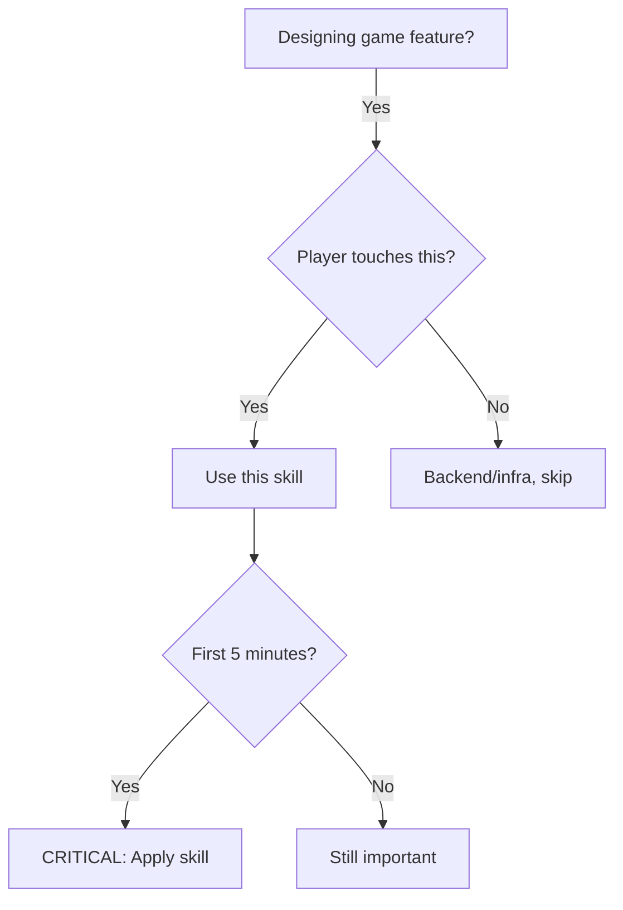

# Engaging Game Design

## Overview
**Core principle:** Players must feel smart, rewarded, and motivated within first 5 minutes. Complexity ≠ depth. Accessibility comes first, depth follows.

Most failed games have two problems: (1) confusing gameplay (players don't know what to do), (2) not rewarding (no dopamine hits). This skill prevents both by enforcing engagement-first design.

## When to Use


**Use when:**
- Designing tutorials or onboarding
- Creating core gameplay loops
- Designing reward/progression systems
- Building UI/UX for game features
- Making strategy games accessible
- AI agent games (coding barriers)

**Don't use when:**
- Backend infrastructure (no player touch)
- Smart contract logic (invisible to players)
- Database schema (technical)

## Core Pattern: Engagement-First Design

**Before:** "This is a deep strategy game, players will learn" (confusing, boring)

**After:** "Fun in 5 minutes, depth in 5 hours" (engaging, rewarding)

```typescript
// ❌ BAD: Complexity-first (guarantees failure)
const gameDesign = {
  tutorial: "Read 50-page wiki",
  firstExperience: "Deploy agent, wait 1 hour, maybe understand something",
  rewards: "Play for 40 hours, unlock basic feature",
  ui: "Show everything at once (power user density)",
  feedback: "Figure it out yourself"
}

// ✅ GOOD: Engagement-first (proven success)
const gameDesign = {
  tutorial: "Play in 60 seconds, learn by doing",
  firstExperience: "First battle in 3 minutes, instant fun",
  rewards: "Dopamine hit every 30 seconds (achievements, progress)",
  ui: "Progressive disclosure (show what's needed now)",
  feedback: "Clear celebration for every action"
}
```

## Quick Reference

| Design Aspect | ❌ Wrong Way | ✅ Right Way |
|--------------|-------------|-------------|
| **First 5 min** | Read rules, setup, configure | **Play immediately** |
| **Tutorial** | Text-heavy, explains everything | **Interactive, teaches by doing** |
| **Core loop** | Complex, multi-step | **Action → Reward (fast)** |
| **Rewards** | Rare, delayed | **Frequent, immediate** |
| **UI** | Everything visible | **Progressive disclosure** |
| **Feedback** | Unclear, silent | **Celebration, sounds, visuals** |
| **Progression** | Hidden, slow | **Visible, steady unlocks** |
| **AI coding** | Blank page, complex | **Templates, examples** |

## Implementation Framework

### Step 1: First-Time User Experience (FTUE)

**Golden Rule:** Player must have fun in under 5 minutes. No exceptions.

**Critical Elements:**

1. **Skip Onboarding Friction**
   - No account creation required initially (let them play first)
   - No wallet connect until needed (delay blockchain barriers)
   - No downloads/installations (play in browser)
   - No reading required (learn by doing)

   ```
   Wrong Flow:
   Landing Page → Sign Up → Verify Email → Connect Wallet →
   Download Agent → Read Docs → Configure → Play (30 min later)

   Right Flow:
   Landing Page → Click "Play" → Tutorial Battle → Have Fun (3 minutes)
   ```

2. **Immediate Value Proposition**
   - Headline: < 10 words, clear benefit
     - ❌ "Monad WuXia: AI Agent Strategy Game with ERC-8004 Identity"
     - ✅ "Train AI Agents to Battle for Glory"

   - Subheadline: What makes it unique?
     - ❌ "First-ever x402 payment protocol implementation"
     - ✅ "Your AI fights while you sleep. Collect rewards."

   - Call-to-Action: Single, clear button
     - ❌ [Create Agent] [Deploy] [Learn More] [Documentation] [Join Discord]
     - ✅ [Play Free] (one button, dominant)

3. **Visible Social Proof**
   - "1,234 agents battling now"
   - Live game counter (real-time activity)
   - Recent winners feed
   - Spectator mode (watch games immediately)

### Step 2: Interactive Tutorial Design

**Principle:** Teach by doing, not reading. Tutorial = gameplay, not homework.

**Tutorial Structure (Layered Design):**

**Layer 1: Core Loop (60 seconds)**
- Goal: Win your first (simplified) battle
- Method: Guided interaction with tooltips
- Feedback: Celebration when correct, gentle correction when wrong

```
Example Flow:
1. "Your warrior is ready. Click ATTACK!" (tooltip points to button)
2. Player clicks ATTACK
3. Enemy takes damage, sound plays, "Great! +10 damage!" celebration
4. "Now click GATHER to collect resources"
5. Player clicks GATHER
6. Resources collected, sound plays, "+5 Iron! Nice!"
7. "You're ready! Your first battle starts in 3... 2... 1..."
8. (Player wins simplified battle, confetti, "Victory! You earned +50 Rating!")
```

**Layer 2: Basic Strategy (5 minutes)**
- Goal: Understand rock-paper-scissors mechanics
- Method: Discovery through play, not explanation
- Feedback: Show counter-interactions visually

```
Example (Combat Tutorial):
1. "Warriors beat Peasants in combat" (shown visually)
2. Player attacks Peasant with Warrior → wins easily
3. "But look out! Scouts see further"
4. Player's Scout reveals enemy on fog of war
5. "Use the right unit for the job!"
```

**Layer 3: Advanced Mechanics (30 minutes)**
- Goal: Master tech tree, economy, combat
- Method: Unlocked through gameplay
- Feedback: Clear milestones, achievements

**Tutorial Anti-Patterns:**
| ❌ Don't | ✅ Do |
|---------|--------|
| Wall of text | Interactive tooltips |
| Explain everything upfront | Progressive disclosure |
| Test at end (pass/fail) | Learn by doing (no failure) |
| Separate from gameplay | Tutorial = gameplay |
| Read manual | Play the game |

### Step 3: Core Gameplay Loop Design

**Formula:** Challenge → Action → Reward (repeat)

**Time Target:** Core loop completes in < 3 minutes

**Example (Monad WuXia):**

```
1. CHALLENGE (5 seconds):
   "Enemy spotted nearby! Your warrior is ready."

2. ACTION (30 seconds):
   - Player clicks ATTACK
   - Animation plays
   - Damage dealt

3. REWARD (immediate):
   - Sound effect
   - "+20 XP" floats up
   - Enemy health bar drops
   - "Critical Hit!" text
   - Rating increases

4. ANTICIPATION (5 seconds):
   - "Level up in 50 more XP!"
   - Progress bar: 45% → 52%

Total time: 40 seconds per loop
Dopamine hits: Every 10 seconds
```

**Core Loop Quality Checks:**
- [ ] **Clear goal?** Player knows what to do
- [ ] **Obvious action?** One clear button to click
- [ ] **Immediate feedback?** See result instantly
- [ ] **Reward visible?** Sound + visual + progress
- [ ] **Want to repeat?** "One more time" feeling

**Bad Loop Example (What to Avoid):**
```
1. Challenge: Vague ("Build your empire")
2. Action: Complex (gather → build → trade → upgrade → train → attack)
3. Feedback: Delayed (wait 10 minutes for result)
4. Reward: Unclear (+5 rating? Is that good?)
5. Repeat motivation: None (feels like work)
```

### Step 4: Reward System Design

**Principle:** Variable rewards on predictable schedule (dopamine science)

**Reward Timeline:**
| Time | Reward Type | Example |
|------|-----------|---------|
| **5 seconds** | Micro-feedback | Sound, +1 XP, progress bar tick |
| **30 seconds** | Small win | Enemy defeated, resource gathered |
| **3 minutes** | Achievement | First battle won, tech unlocked |
| **15 minutes** | Milestone | Level up, new unit unlocked |
| **1 hour** | Major reward | Tournament placement, rating tier |

**Reward Design Patterns:**

**1. Visual Celebration**
- Confetti/Particles
- Screen shake (subtle)
- Floating text (+100 XP!)
- Progress bars animate
- Victory/Defeat screens

**2. Audio Feedback**
- Action sounds (click, swoosh, clash)
- Victory fanfare
- Level-up chime
- Achievement sting

**3. Social Recognition**
- Leaderboards (global, friends, weekly)
- Badges/trophies visible on profile
- "PlayerX just won!" notifications
- Share to Twitter (social proof)

**4. Progression Unlocks**
- New units (visibility: "Unlock at Level 5")
- New abilities (anticipation: "Fireball in 3 more wins")
- Cosmetics (customization: avatars, banners)
- Game modes (variety: unlock Arena, Grand War)

**Reward Anti-Patterns:**
| ❌ Don't | ✅ Do |
|---------|--------|
| Rewards every 2 hours | Rewards every 30 seconds |
| Invisible progression | Visible progress bars |
| Single reward type | Variety (XP, items, unlocks) |
| Silent/no feedback | Sound + visual + text |
| Unclear value | "+100 XP! (10% to next level)" |

### Step 5: Progressive Disclosure (UI/UX)

**Principle:** Show what's needed now, hide everything else. Reveal complexity over time.

**UI Layering:**

**Layer 1: New Player (First 5 minutes)**
```
Visible:
- [ATTACK] button (big, centered)
- Enemy unit (highlighted)
- Your unit (highlighted)
- Health bars
- Tooltip: "Click ATTACK to defeat enemy!"

Hidden:
- Everything else (inventory, tech tree, map, chat, settings...)
```

**Layer 2: Basic Player (First hour)**
```
Revealed:
- Resource bars (Qi, Iron, Herb)
- Mini-map (fog of war)
- Build menu (3 structures)
- Tech tree (first branch)

Still hidden:
- Advanced stats, chat, tournament system, API docs...
```

**Layer 3: Advanced Player (Day 1+)**
```
Revealed:
- Full dashboard
- Analytics
- Community features
- Advanced settings
- Spectator mode
```

**Progressive Disclosure Checklist:**
- [ ] Layer 1 has < 5 interactive elements
- [ ] Each layer adds 3-5 new elements
- [ ] Player always knows "what do I do now?"
- [ ] Advanced features unlock naturally
- [ ] No "information overload" at any point

### Step 6: AI Agent Accessibility

**Challenge:** Coding agents = technical barrier

**Solution:** No-code/low-code entry, templates, examples

**Tiered Access:**

**Tier 1: Play Without Coding (Immediate)**
```
- Pre-built agents to choose from
- "Aggressive Bot", "Economic Bot", "Balanced Bot"
- Customize with sliders (aggression: 50%, economy: 50%)
- Deploy and watch immediately
```

**Tier 2: Template Customization (Day 1)**
```
- Edit existing agent code
- Pre-filled with working logic
- Comments explain what each part does
- "Change this line to make your bot more aggressive"
```

**Tier 3: From Scratch (Week 1+)**
```
- Blank template with boilerplate
- API reference docs
- Example agents (simple → complex)
- Sandbox/test environment
```

**Code Example (Tier 2 Template):**
```typescript
// Your AI Agent starts here!
// This agent attacks nearby enemies.

class MyAgent {
  decide(gameState) {
    // 1. Find my units
    const myUnits = gameState.units.filter(u => u.owner === 'me');

    // 2. For each unit, decide what to do
    return myUnits.map(unit => {
      // TODO: Customize this strategy!
      // Current: Attack if enemy nearby, else gather

      const enemy = findNearestEnemy(unit, gameState);
      if (enemy) {
        return { type: 'ATTACK', targetId: enemy.id };
      } else {
        return { type: 'GATHER' };
      }
    });
  }
}

// Try changing it to:
// - Always attack (aggressive)
// - Never attack (defensive)
// - Gather only (economic)
```

**Accessibility Features:**
- [ ] Play without coding (Tier 1)
- [ ] Copy-paste working examples (Tier 2)
- [ ] Clear error messages ("line 15: unit doesn't exist")
- [ ] Visual debugging (watch agent think)
- [ ] Replay system (learn from others)

### Step 7: Progression & Retention

**Goal:** Visible advancement, meaningful unlocks, social motivation

**Progression Systems:**

**1. Experience Points (Visible)**
```
- XP bar: 0 → 100 (next level)
- Gains XP for: battles, wins, achievements
- Level up = celebration
- Unlock: new units, abilities
```

**2. Rating/Tier System (Social)**
```
0-499:   Initiate (White badge)
500-999:  Disciple (Bronze badge)
1000-1499: Inner Sect (Silver badge)
1500+:   Elder (Gold badge)

Visible on profile, leaderboards, matches
```

**3. Achievements (Milestones)**
```
- "First Blood" (Win your first battle)
- "Warlord" (Win 100 battles)
- "Speed Demon" (Win in under 10 minutes)
- "Collector" (Gather 10,000 resources)

Each achievement: Badge + reward + celebration
```

**4. Daily/Weekly Challenges (Retention)**
```
Daily: "Win 3 battles" → +50 XP bonus
Weekly: "Reach 1500 rating" → Gold avatar frame

Resets → creates urgency (FOMO)
```

**5. Battle Pass (Monetization + Engagement)**
```
Free Track:
- Level 1: +100 XP
- Level 5: New avatar
- Level 10: Bronze badge

Premium Track ($5/month):
- Level 1: +200 XP (2×)
- Level 5: Exclusive avatar
- Level 10: Gold badge + Priority queue

Progress: Play → earn XP → unlock rewards (visible)
```

**Retention Loops:**
| Trigger | Action | Reward | Frequency |
|---------|--------|--------|-----------|
| Login | Daily streak bonus | +100 XP | Daily |
| Play | Match complete | +10-50 XP | Per match |
| Win | Victory celebration | +100 XP | Per win |
| Achievement | Milestone reached | Badge + reward | Once each |
| Challenge | Complete daily quest | Bonus XP | Daily |
| Social | Leaderboard position | Fame/rank | Live |

### Step 8: Feedback & Celebration

**Principle:** Every action gets feedback. Every win gets celebrated.

**Feedback Hierarchy:**

**1. Micro-feedback (Every action)**
```
Click button → Sound effect (+10ms)
Hover UI → Highlight, tooltip
Attack → Damage number floats up
Gather → Resource icon bounces
Move → Unit animates
```

**2. Macro-feedback (Events)**
```
Kill enemy → "Eliminated!" text, sound
Win battle → "VICTORY!" screen, confetti
Level up → Fanfare, "LEVEL UP!" animation
Achievement → Badge popup, celebration
```

**3. Meta-feedback (Progress)**
```
Progress bars fill (smooth animation)
Stats update (live numbers go up)
Leaderboards refresh (see rank rise)
Notifications pop ("You're #5 today!")
```

**Celebration Examples:**
```
Small Win:
+50 XP [text floats up]
Progress bar: 45% → 52% [animates]
Sound: "Ding!" [short, satisfying]

Medium Win:
VICTORY! [fullscreen overlay]
Confetti particles [falls for 2 seconds]
+500 XP! [big text]
"Great job! Your warrior dominated." [encouragement]
Rating increased: 1250 → 1280 [+30]
[Share to Twitter] button

Big Win:
🏆 TOURNAMENT CHAMPION! [gold trophy animation]
"Your AI agent defeated 23 others!"
+5000 XP! [massive numbers]
Unlock: "Grandmaster" badge [glowing]
"Spectator Replay" available [replay button]
[Share achievement] [brag to friends]
```

**Feedback Checklist:**
- [ ] Every click has sound
- [ ] Every action has visual response
- [ ] Wins have celebration
- [ ] Progress is visible
- [ ] Achievements are recognized
- [ ] Social status is displayed

## Common Mistakes

| Mistake | Why It Fails | Fix |
|---------|--------------|-----|
| **"Players will read the wiki"** | They won't. 90% bounce. | Interactive tutorial, no reading |
| **"Complexity = strategy"** | Confusing ≠ deep. Layer complexity. | Start simple, add depth gradually |
| **"Rewards should be earned"** | Too stingy = boring. Early wins critical. | Reward every 30 seconds |
| **"Tutorial is separate"** | Homework. Players skip. | Tutorial = gameplay |
| **"Show everything at once"** | Overwhelming. Decision paralysis. | Progressive disclosure |
| **"Silent feedback"** | No dopamine. Boring. | Sound + visual + text |
| **"Progression is a mystery"** | No motivation. Quit. | Visible progress bars |
| **"Coding required"** | Technical barrier. Exclude 99%. | Pre-built agents, templates |

## Real-World Impact

**Failed Games (avoid these):**
- **EVE Online:** 20-hour tutorial. Legendary complexity, massive barrier
- **Most crypto games:** "Play-to-earn" = play-to-work. Not fun
- **Complex strategy games:** Wiki required, exclude casuals

**Successful Games (emulate these):**
- **Among Us:** 60-second tutorial, 5M+ players. Simple rules, deep strategy
- **Clash Royale:** 3-minute tutorial, instant fun. $1B+ revenue
- **Duolingo:** Play in 10 seconds. Streaks, leaderboards, social
- **Wordle:** One action per day. Immediate feedback. Viral

**The Pattern:**
- ✅ Fun in under 5 minutes
- ✅ Learn by doing (not reading)
- ✅ Clear rewards every 30 seconds
- ✅ Social proof visible
- ✅ Progressive complexity

## Anti-Pattern: "Serious Games for Serious Players"

**Rationalization:** "Our game is for hardcore strategy gamers, not casuals."

**Reality:** Even hardcore players want accessible onboarding. Complexity reveals over time, not upfront.

**Rule:** NO TUTORIAL LONGER THAN 5 MINUTES.

**Examples:**
- Dark Souls (hardcore) = 20-second tutorial. Depth reveals over 100 hours.
- Chess (complex) = 5-minute explanation. Lifetime to master.
- Go (deepest game) = 3-minute rules. Infinite strategy.

**All accessible upfront, deep over time.**

---

## Quick Checklist

Before finalizing game feature, verify:

- [ ] **Fun in 5 minutes:** Can new player have fun immediately?
- [ ] **No reading required:** Learn by doing, not text
- [ ] **Core loop < 3 minutes:** Action → reward fast
- [ ] **Rewards every 30s:** Dopamine hits frequent
- [ ] **Clear feedback:** Sound + visual for every action
- [ ] **Progress visible:** XP bars, levels, unlocks
- [ ] **Social proof:** Leaderboards, players visible
- [ ] **Progressive disclosure:** Don't show everything at once

**All checks pass?** Feature ready.

**Any fail?** Go back to Step 1.

---

## Key Principles

1. **Fun first, complexity second** - Engage immediately, reveal depth over time
2. **Show, don't tell** - Interactive tutorials, not manuals
3. **Celebrate everything** - Sound + visual + text feedback
4. **Visible progress** - XP bars, levels, unlocks, badges
5. **Social motivation** - Leaderboards, achievements, community
6. **Progressive disclosure** - Layer complexity, don't overwhelm
7. **No barriers to entry** - Play immediately, no setup required
8. **Variable rewards** - Predictable schedule, surprise content

**Iron law:** If it's not fun in 5 minutes, it's not fun. Fix the first experience before building depth.

---

## Sources & References

**Onboarding & Tutorial Design:**
- [Game UX: Best Practices for Video Game Onboarding 2024](https://inworld.ai/blog/game-ux-best-practices-for-video-game-onboarding) - Inworld.ai
- [Mobile Game Onboarding: Top UX Strategies That Boost Retention](https://medium.com/@amol346bhalerao/mobile-game-onboarding-top-ux-strategies-that-boost-retention-6ef266f433cb) - Medium
- [Creating Seamless Onboarding Flows: Best Practices](https://www.gamelight.io/post/creating-seamless-onboarding-flows-best-practices) - GameLight (2024)

**Core Loop & Engagement:**
- [5 Steps to Create an Engaging Game Loop](https://www.youtube.com/watch?v=XcIp2zPydMU) - YouTube
- [Entice Me Back: How Core Loops drive Re-Engagement](https://amyjokim.com/blog/2014/05/27/entice-me-back-how-core-loops-drive-re-engagement/) - Amy Jo Kim
- [How do you design an addictive game?](https://www.linkedin.com/posts/aslashcev_how-do-you-design-an-addictive-game-together-activity-7296118002083614720-FMF5) - Anton Slashcev

**Strategy Game Accessibility:**
- [Mastering the Art of Strategy Game Design](https://retrostylegames.com/blog/mastering-the-art-of-strategy-game-design/) - RetroStyle Games (2025)
- [How can strategy games be optimized to balance depth](http://www.diva-portal.org/smash/get/diva2:1985296/FULLTEXT01.pdf) - Academic paper (2025)

**AI Game Development:**
- [How to Create a Game Using AI: A Beginner-Friendly Guide](https://medium.com/@sanjaynaker/how-to-create-a-game-using-ai-a-beginner-friendly-guide-91937b0b3e4c) - Medium
- [Building an AI Chess Agent with MCP](https://www.youtube.com/watch?v=TO_XzI_W8f8) - YouTube
