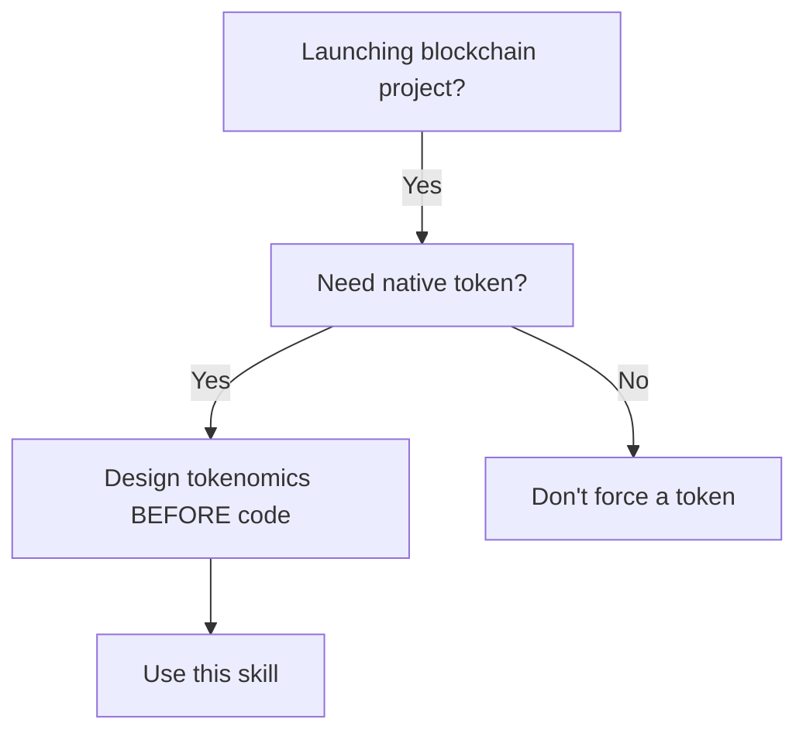

# Tokenomics Design

## Overview
**Core principle:** Token value comes from DEMAND (utility) > SUPPLY (inflation). Design economics first, then token.

Most failed tokens have three problems: (1) no real utility, (2) excessive inflation, (3) no sustainability planning. This skill prevents those failures.

## When to Use


**Use when:**
- Starting new blockchain/Web3 project
- Designing native token for protocol
- Preparing for token sale/IDO/IEO
- Redesigning existing broken tokenomics

**Don't use when:**
- Project doesn't need a token (use existing ones)
- Just wanting to "launch a token" without product
- Token is purely speculative (will fail)

## Core Pattern: Demand-Side Design

**Before:** "We need a token, what should supply be?" (SUPPLY-FIRST thinking)

**After:** "What creates token DEMAND? Now match supply." (DEMAND-FIRST thinking)

```typescript
// ❌ BAD: Supply-first design (guarantees failure)
const tokenomics = {
  totalSupply: "1 billion",
  distribution: {
    team: "40%",      // Dump risk
    advisors: "10%",  // No vesting
    public: "50%"
  }
  // No utility, no burns, no sustainability
}

// ✅ GOOD: Demand-first design (sustainable)
const tokenomics = {
  // 1. Define utility FIRST
  utility: {
    protocolFees: "Pay fees with token (10% discount)",
    governance: "1 token = 1 vote on protocol upgrades",
    staking: "Stake to validate (requires 10K tokens)",
    collateral: "Required to borrow/lend (varies by asset)"
  },

  // 2. Calculate demand from utility
  demandDrivers: {
    activeUsers: 10000,           // Target users
    avgTokensPerUser: 100,        // Based on utility needs
    minCirculatingSupply: 1000000 // 10K users × 100 tokens
  },

  // 3. Set supply to match demand (with buffer)
  totalSupply: "10000000",        // 10× circulating target
  maxInflationRate: "8%",         // Sustainable inflation

  // 4. Design distribution to prevent dumps
  distribution: {
    team: "15%",        // Market-standard
    teamVesting: "4 years, 1 year cliff, quarterly unlocks",
    advisors: "3%",
    advisorVesting: "2 years, 6 month cliff, quarterly unlocks",
    publicSale: "20%",
    ecosystem: "35%",   // Incentives, partnerships
    reserve: "27%"      // Treasury, future development
  },

  // 5. Model sustainability
  sustainability: {
    tokenSinks: ["protocol fees burned", "staking lockups", "collateral requirements"],
    yearlyEmission: "800K tokens max (8%)",
    protocolRevenue: "50% of fees buyback & burn tokens",
    threeYearSupply: {
      year1: "1.8M tokens",
      year2: "2.6M tokens",
      year3: "3.4M tokens"
    }
  }
}
```

## Quick Reference

| Step | Question | Answer Must Include |
|------|----------|-------------------|
| **1. Utility** | What does token DO? | Concrete use cases: "User pays X tokens to do Y" |
| **2. Demand** | Who buys & why? | User types, amounts, frequency |
| **3. Supply** | Total supply & inflation | Justified by demand, not arbitrary |
| **4. Distribution** | Who gets what? | Percentages + vesting/cliff schedules |
| **5. Sustainability** | Viable in 3 years? | Model shows token flows, sell pressure, revenue |

## Implementation Framework

### Step 1: Define Token Utility (DEMAND SIDE)

**Every token must answer: "What do I DO?" not "What will I be WORTH?"**

**Required utility components:**

| Utility Type | Description | Example |
|--------------|-------------|---------|
| **Fee payment** | Pay protocol fees with token | "Pay 100 tokens to borrow $1000 USDC" |
| **Governance** | Vote on protocol decisions | "1 token = 1 vote on upgrades" |
| **Staking** | Lock tokens for rewards/access | "Stake 10K tokens to validate" |
| **Collateral** | Required to use protocol features | "500 tokens collateral to open position" |
| **Burn** | Tokens removed from supply | "50% of protocol fees burned monthly" |

**Red flag:** Token utility is just "staking" or "governance" without concrete actions. These are speculation enablers, not real utility.

### Step 2: Calculate Token Demand

**Quantify who needs tokens and why:**

```
Total Demand = (User Count) × (Avg Tokens Per User) × (Turnover Rate)

Example:
- Active users: 10,000 (target)
- Tokens per user: 100 (based on utility requirements)
- Annual turnover: 2× (users exit/re-enter)
- Annual demand: 10,000 × 100 × 2 = 2,000,000 tokens/year
```

**Include demand from:**
- Core users (active protocol participants)
- Investors/speculators (accept 20-30% of demand)
- Partners/integrations (if applicable)

### Step 3: Set Supply & Inflation

**Supply MUST be justified by demand, not arbitrary numbers:**

| Supply Type | Formula | Target |
|-------------|---------|--------|
| **Total supply** | Annual Demand × Years to Market Saturation | 3-10× annual demand |
| **Circulating at TGE** | Total Supply × (15-30%) | Start low, grow with usage |
| **Max inflation** | New Tokens / Current Supply | <10% annually (sustainable) |

**Inflation killers to avoid:**
- ❌ Staking APY > 50% (unsustainable sell pressure)
- ❌ Emission > 15% year-over-year
- ❌ No emission cap or decay schedule
- ❌ Rewards unlock immediately (no vesting)

**Sustainable inflation models:**
- ✅ Emission decay: "Rewards halve every 12 months"
- ✅ capped supply: "Max 1B tokens ever created"
- ✅ Vesting on rewards: "Staking rewards vest over 90 days"
- ✅ Protocol revenue backs token: "50% of fees buyback tokens"

### Step 4: Design Token Distribution

**Distribution percentages MUST include vesting:**

| Recipient | Standard % | Required Vesting |
|-----------|------------|------------------|
| **Team** | 10-20% | 4 years, 1 year cliff |
| **Advisors** | 2-5% | 2 years, 6 month cliff |
| **Investors** | 10-20% | 6-12 month cliff, then linear |
| **Public sale** | 15-25% | 20% at TGE, rest unlocked over 6-12 months |
| **Ecosystem** | 30-40% | Released over 3-5 years per roadmap |
| **Reserve/Treasury** | 15-25% | Multi-sig, quarterly releases for approved use |

**Calculate unlock sell pressure:**
```
Monthly Unlock = (Allocation % × Total Supply) / Vesting Months

Example (Team: 15%, 1B supply, 4-year vesting after 1-year cliff):
- Monthly unlocks after month 12: (0.15 × 1B) / (48 months) = 3.125M tokens/month
- At $1/token: $3.125M monthly sell pressure
- Can protocol revenue absorb this? If not, reduce allocation or extend vesting.
```

**Red flags:**
- Team > 25% (too much control, dump risk)
- No vesting (immediate dump risk)
- Advisors < 6 month cliff (liquidity too early)
- Public sale > 50% at TGE (overhang crushes price)

### Step 5: Model Sustainability (3+ Years)

**Tokenomics must survive worst-case scenarios:**

**Required analysis:**
```typescript
interface SustainabilityModel {
  // Token supply over time
  supplyProjection: {
    year1: number;  // Include emissions, unlocks
    year2: number;
    year3: number;
  };

  // Sell pressure from unlocks
  unlockPressure: {
    teamUnlocks: number;       // Tokens/month
    advisorUnlocks: number;
    investorUnlocks: number;
    totalMonthly: number;
    canProtocolAbsorb: boolean; // Buyback vs. sell pressure
  };

  // Buy pressure / demand
  demandDrivers: {
    userGrowth: number;        // New users/month
    protocolRevenue: number;   // USD/month to buyback/burn
    tokenBurns: number;        // Tokens burned/month
    totalMonthlyBuy: number;
  };

  // Net flow (positive = sustainable)
  netTokenFlow: {
    monthly: number;           // Buys - Sells
    yearly: number;
    isSustainable: boolean;    // Positive for 3+ years
  };

  // Scenario analysis
  scenarios: {
    baseCase: number;          // Normal adoption
    bearCase: number;          // 90% drop in activity
    bullCase: number;          // 10× adoption
  };
}
```

**Answer these questions:**
1. If crypto bear market lasts 2 years, does token survive?
2. If user growth is 50% of projections, is model viable?
3. What happens to price when team tokens unlock at month 13?
4. Does protocol revenue exceed unlock sell pressure?

**Can't answer these?** Tokenomics not ready. Go back to Step 1.

### Step 6: Document & Validate

**Final tokenomics must include:**

1. **Utility statement** (1 paragraph)
   - What token does
   - Why users need it
   - Not "hold to sell later"

2. **Supply schedule** (table)
   ```
   | Period | Circulating Supply | New Emissions | Unlocks |
   |--------|-------------------|---------------|---------|
   | TGE    | 150M              | 0             | 150M    |
   | Y1     | 250M              | 100M          | 200M    |
   | Y2     | 340M              | 90M           | 180M    |
   | Y3     | 420M              | 80M           | 160M    |
   ```

3. **Distribution breakdown** (table with vesting)
   ```
   | Recipient | %   | Amount | Vesting               | Cliff  |
   |-----------|-----|--------|-----------------------|--------|
   | Team      | 15% | 150M   | 4yr, quarterly        | 1yr    |
   | Advisors  | 3%  | 30M    | 2yr, quarterly        | 6mo    |
   | Public    | 20% | 200M   | 20% TGE, rest linear  | 0      |
   | Ecosystem | 35% | 350M   | Over 5 years          | 0      |
   | Reserve   | 27% | 270M   | Multi-sig releases    | 0      |
   ```

4. **Inflation rate** (chart showing <10% yearly)
5. **Sustainability analysis** (3-year projection)
6. **Risk disclosures** (what could break the model)

## Common Mistakes

| Mistake | Why It Fails | Fix |
|---------|--------------|-----|
| **"1 billion supply" without justification** | Arbitrary → no relationship to demand | Calculate demand first, set supply 3-10× |
| **"1000% APY staking"** | Unsustainable → token death spiral | Cap at 20-50%, include emission decay |
| **"Team gets 40%"** | Too much → dump risk, community distrust | Cap team at 10-20%, 4-year vesting |
| **"No vesting for advisors"** | Advisors dump at TGE → price collapse | Minimum 6-month cliff |
| **"Staking = utility"** | Speculation, not real use | Add actual use cases: fees, collateral |
| **"Governance = utility"** | Meaningless without proposals | List specific governance rights |
| **"Token will appreciate"** | Speculation, not fundamentals | Show buy pressure: revenue, burns, demand |
| **"We'll figure out burns later"** | Never happens → inflation | Design burns upfront: fee % to burn |
| **"'Early bird' 2× rewards"** | Ponzi-like, attracts mercenary capital | Flat rewards for all stakers, loyalty bonus >180 days |

## Real-World Impact

**Failed tokenomics (avoid these):**
- **Wonderland (TIME)**: 100,000% APY → collapsed in 3 months
- **Stepn (GST)**: P2E inflation → token down 99%
- **Hundreds of "L2 tokens"**: No utility → trading at $0.0001

**Successful tokenomics:**
- **Ethereum (ETH)**: Required for gas + staking → sustainable demand
- **Uniswap (UNI)**: Governance + fee switching → clear utility
- **MakerDAO (MKR)**: Required to collateralize + governance → baked-in demand

**The difference:** Successful tokens have CONCRETE UTILITY that creates demand. Failed tokens are speculative.

## Anti-Pattern: "We'll Add Utility Later"

**Rationalization:** "Launch token now, build utility later"

**Reality:** Once token launches, you're incentivized to pump price, not build utility. Team dumps, community loses trust, project dies.

**Rule:** NO TOKEN WITHOUT UTILITY DEFINED FIRST.

If utility isn't clear, don't launch a token. Use existing ones (USDC, ETH, etc.).

---

## Quick Checklist

Before finalizing tokenomics, verify:

- [ ] **Utility**: Can describe "User pays X tokens to do Y" in 3+ scenarios
- [ ] **Demand**: Calculated annual demand in tokens (not "people will want it")
- [ ] **Supply**: Justified total supply (3-10× annual demand)
- [ ] **Inflation**: Max yearly inflation <10%, with emission decay
- [ ] **Distribution**: All allocations have vesting (team 4yr, advisors 2yr, investors 6-12mo)
- [ ] **Sustainability**: Modeled 3-year token flows (supply, unlocks, revenue)
- [ ] **Scenarios**: Tested bear case (90% drop in activity) - token survives?
- [ ] **No speculation**: Utility comes first, price second

**All checks pass?** Tokenomics ready.

**Any fail?** Go back to Step 1.

---

## Key Principles

1. **Demand before supply** - Design what token does, then how many exist
2. **Utility > speculation** - Token must be useful, not just tradable
3. **Inflation kills** - Cap emissions, vest everything, model sustainability
4. **Align incentives** - Team vesting = long-term commitment
5. **Quantify everything** - No hand-wavy "community will drive value"
6. **Test worst cases** - Bear markets last 2+ years, plan accordingly
7. **No token without utility** - If unclear, don't launch

**Iron law:** Token value = Utility Demand / Token Supply. Increase demand (utility) or decrease supply (burns/vesting). Anything else is speculation.
